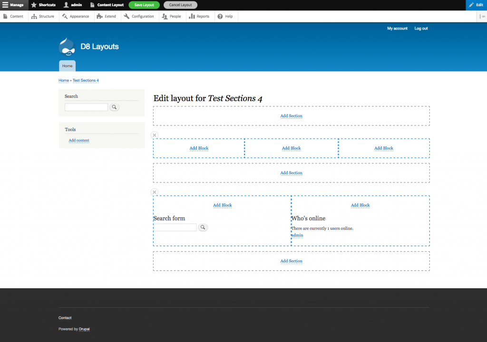

+++
author = "Brian Osborne"
title = "The challenge of using responsive image styles with Drupal's layout builder"
date = 2019-04-04
tags = [
  "Drupal Planet",
]
+++

## Responsive images overview

As screen resolutions and pixel densities continue to climb year after year, it's becoming more important to deliver the best possible image quality to your visitors. The easy way out is to deliver a single high resolution image, but this can have a real impact on page load time & bandwidth usage, especially for visitors on mobile devices & networks. The better solution is to deliver the appropriately sized image based on the screen width/resolution of the browser. So, instead of always delivering a super high res image to mobile device users (who's browsers will be forced to downsize the image to fit anyway), deliver an image that's better sized for that screen. Smaller resolution images have a much smaller filesize, so your visitors won't have to download as much data and the image will download faster.

Thankfully, a native HTML solution for delivering different images for different browser viewports has existed for years: using the "srcset" and "sizes" attributes of the existing &lt;img&gt; element.

To quickly demonstrate how it works, let's take this super simple scenario of an image on your site that will always be displayed at 100% width of the browser. This is how the image element would look:

```

```

The `srcset` attribute provides your browser a list of images and how wide each is in real pixels. The `sizes` attribute tells the browser how wide the image will be displayed after it's been laid out and CSS rules applied to it.

But wait, don't browsers _already know_ how wide an image will be when it's rendered on a page? It's responsible for rendering the page after all! Why can't it just figure out how wide the image will be rendered and then just select the most appropriate image source from the "srcset" list? Why is this "sizes" attribute needed at all?

Well, it's true that browsers know this information, but they don't know it until they have completed parsing all JS and CSS on the page. Because processing the CSS/JS takes a while, browsers don't wait and will instead begin downloading images referenced in your HTML immediately, meaning they need to know what image to download immediately.

In the simple scenario above, the site is designed to always render the image at 100% width via CSS, so we indicate as such by adding a single value "100vw" (vw stands for viewport width) to the sizes attribute. The browser then decides which image to load depending on the width of the viewport when the page is loaded. An [iPhone 8 in portrait mode has a "CSS" width of 375 pixels](https://developer.apple.com/library/archive/documentation/DeviceInformation/Reference/iOSDeviceCompatibility/Displays/Displays.html), but it has a 2:1 pixel density ratio (a "retina" screen), which means it can actually display images that are double that width at 750px wide. So the browser on this phone will download the lower resolution version of the image which happens to match exactly at 750px wide. On a 1080p desktop monitor the browser will be wider than 750px wide, so the larger resolution image will be downloaded.

Responsive images delivered in this manner work really well for this simple use case.

Things start to get more complicated when the image being displayed on your site does NOT take up the full width of the browser viewport. For example, imagine a site design where an image is displayed 1500px wide at the desktop breakpoint, but is displayed at 50% width at tablet/mobile breakpoints. Now the image element changes to this:

```

```

The sizes attribute has changed to indicate that if the viewport width is at least 1500px wide, then the site's CSS is going to render the image at 1500px and no larger. If the viewport width is lower, then that first rule in the sizes attribute fails, and it falls back to the next one, so the site will render the image at 50% viewport width. The browser will translate that value to an actual pixel width (and take into account pixel density of the device) to select the appropriate image to download.

## The problem this creates for dynamic layout builders

Now, imagine a dynamic layout builder tool on a content management system, like the new Layout Builder module for Drupal 8:



This great layout tool allows site builders to dynamically add rows and columns to the content region of a page and insert blocks of content into the columns. 

One of the "blocks" that can be inserted into a column is an image. How do you determine the value of the "sizes" attribute for the image element? Remember, the sizes attribute <em>tells the browser how wide the image will be when it's rendered and laid out by your CSS</em>. Let's just focus on desktop screen resolutions for now, and say that your site will display the content region at a width of 1500 CSS pixels for desktops. A site builder could decide to insert an image in any of the following ways:

* Into a single column row (image displays at 1500px wide)
* Into the left-most column of a 50% - 25% - 25% row (image displays at 750px wide)
* Into the right-most column of a 33% - 33% - 33% row (image displays at 500px wide)

The value of the "sizes" attribute differs for each of those three scenarios, which means that when Drupal is generating the image element markup, it needs to know the width of the column that the image was placed in.

The Drupal-specific problem is that (to my current knowledge) there's no practical way for the code that generates the image element markup to know information about the column the image was inserted in. Without this knowledge transfer, it's impossible to convey an accurate value for the "sizes" attribute.

Things get even more complicated if you're developing a solution that has to work with multiple different themes, where each theme may have different breakpoints and rules about the width of the content region at various breakpoints. What if some pages on your site have a sidebar menu, and others don't? That affects the the width of the content region and can easily throw off your `sizes` attribute calculations as well.

## Moving forward

I think this is a new and interesting challenge, and I don't know that anyone has put much thought into how to solve it yet. I'm certainly hoping others read this and provide some ideas, because I'm not sure what the best solution is. The easy solution is of course to just not output the image responsively, and just use a single image src like the old days. In the example above, the image would need to be 1500px wide to account for the largest possibility. 