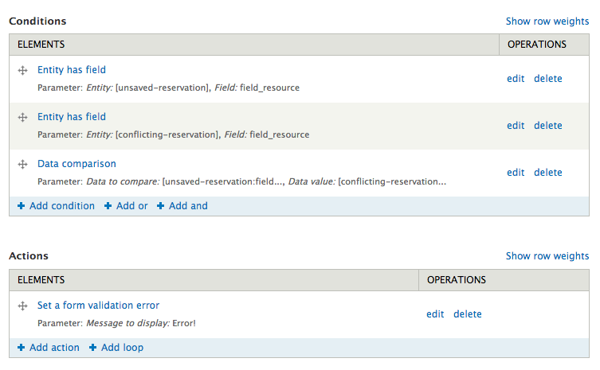
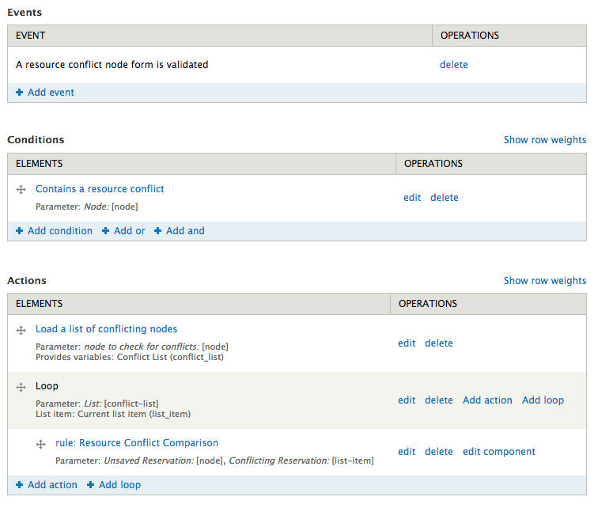

+++
author = "Brian Osborne"
title = "Creating a Resource Calendar in Drupal 7"
date = 2014-02-05
tags = [
  "Drupal Planet",
]
+++

I just finished up a small project at work to create a basic resource management calendar to visualize and manage room and other asset reservations. The idea was to have a calendar that displayed reservations for various resources and allow privileged users the ability add reservations themselves. The existing system that was being used was a pain to work with and very time consuming - and I knew this could be done easily in Drupal 7. The solution could be extended to create a more general resource booking / room booking system.

I wanted to share the general setup I used to get this done. I won't go into fine detail, and this is not meant to be a complete step by step guide. I'm happy to answer any questions in the comments.

Step 1: The "Reservation" content type
--------------------------------------

I quickly created a new content type "Resource Reservation" and added a required date field. Due to a bug in a module I used below, I had to use a normal date field and not ISO or Unix (I usually prefer Unix timestamps). These three different types of date fields are [explained here](https://drupal.org/node/1455576). Aside from that, I also made the date field have a **required end date** and support **repeating dates** using the Date Repeat Field module (part of the main Date module). I then needed to decide how I would manage the resources and link them to a reservation.

I created another content type "Resource" and linked it to a reservation using the [Entity Reference](https://drupal.org/project/entityreference) module. Another option I considered was using a Taxonomy vocabulary with terms for reach resource, and adding a term reference field to the reservation content type. I decided to go for a full blown entity reference to allow greater flexibility in the future for the actual resource node.

In my case, I created the 6 "Resource" nodes (all rooms in a building) that would be used in my department.

Step 2: The Calendar
--------------------

Years ago at the 2011 DrupalCamp NJ, I attended Tim Plunkett's session "[Calendaring in Drupal](http://drupalcampnj2012.drupalcamp.org/sessions/calendaring-drupal.html)." Tim provided a great introduction to a new Drupal module called [Full Calendar](https://drupal.org/project/fullcalendar) that utilized an existing JavaScript plugin with the same name. I was very impressed with the capability of the module and [wrote about it](http://www.bkosborne.com/blog/looking-new-fullcalendar-module-drupal) after the camp was over.

I immediately knew I wanted to use the module and was happy to see it has been well maintained since I last checked it out in 2012. The setup was incredibly simple:

*   Create a new "Page" view displaying node content
*   Set the style to "Full Calendar"
*   Add a filter to only show published "Resource Reservation" node
*   Add the date field that is attached to "Resource Reservation" nodes

The style plugin for Full Calendar has a good set of options that let you customize the look and functionality of the calendar. I quickly able to shorten it quite a bit to display the start and end times as "7:30a - 2:00p".

One thing to note is that while you can add any fields you want to the view, the style plugin only utilizes two: A date field and a title field. Both are displayed on the calendar cell - and nothing else. If you add a date field, the style plugin automatically uses it as "the" date field to use, but if you have multiple date fields for whatever reason you can manually specify it in the settings. Similarly, for the title field, you can add any field and tell the plugin which one to use as "the" title for the event. In my case the node title was suitable. If you wanted to display more than one field, try adding them and then add a global field that combines them, then assign that as the title field.

I loaded up some reservation nodes and viewed them in the calendar and everything was looking great so far. Next I wanted to provide some filtering capability based on the resource of the reservation "events".

Step 3: Filtering the Calendar by Resource
------------------------------------------

In my case there was a desire to be able to display the reservations for select resources at a time instead of all of them at once. This would be a heavily used calendar with lots of events each day, and it would become a mess without some filtering capability. This was easy enough by creating an exposed filter for the calendar view.

Ideally I would have a filter that exposed all of the possible resources as checkboxes - allowing the user to control what reservations for what resource they are viewing. I'm sure I could have done that by writing my own views filter plugin or doing some form altering, but I settled for this approach:

*   Added a new input filter for my "Resource" entity reference field.
*   Exposed it
*   Made it optional
*   Changed it to "grouped filter" instead of "single filter". This let me specify each Resource individually since there's no out-of-the-box way of listing all available.
*   Used the "radio" widget
*   Allowed multiple selections - this actually changed the radio buttons to checkboxes instead - exactly what I want.
*   Added 6 options for the filter - one for each resource. I looked up the node ID's for each resource and put them in with their appropriate label. Downside is each time a new resource is added I have to manually update the filter.
*   Changed the "filter identifier" to the letter "r", so that the query string params when filters are used aren't so awful looking

There are two major gotchas here. The first is that if you have more than 4 options to chose from, Views changes the checkboxes to a multi select field (bleh). This is an easy fix:

```
function YOUR_MODULE_form_views_exposed_form_alter(&$form, &$form_state) {
  if ($form['#id'] == 'views-exposed-form-calendar-page') { # find your own views ID
    $options =& $form['r']; # my exposed field is called "r" (see last step above)
    if ($options['#type'] == 'select') {
      $options['#type'] = 'checkboxes';
      unset($options['#size']);
      unset($options['#multiple']);
    }
  }
}
```

This ensures that the exposed filter is ALWAYS going to be checkboxes. The second gotcha is how views handles the multiple selections. By default, views will "AND" all of the selections together. So if you select "Room 5" and "Room 6", I get reservations that have both selected - which is not possible in my case since I purposely limited the entity reference field on the reservation to only reference one resource. Instead I want views to "Or" them, so it shows any reservations for either "Room 5" or "Room 6". The fix for this is simple, but not obvious:

*   In the filter criteria section in the View UI, I went to "Add/Or, Rearrange" which is a link in the drop down next to the "Add" button.
*   I created a new filter group and dragged my exposed filter into it.
*   The top group has the published filter and the content type filter, and the operator is set to AND.
*   The bottom group has my single exposed filter for the resource, and the operator is set to OR.
*   The two groups are joined together with an AND operator.

Setting the second group to use OR is the key here. Even though there is just one item in the filter group, it's a special filter because it allows multiple selections. Views recognizes this and will apply the OR operator to each selection that was made within that filter. By default I had everything checked (which is actually the same as having nothing checked, at least in terms of the end result). This makes it obvious to calendar viewers that they can uncheck resources.

Step 4: Adding Colors for each Resource
---------------------------------------

Since the default calendar view includes 6 resources, I wanted each resource to be displayed with a color that corresponded to the resource it was reserving. The Full Calendar module can sort of do this for you with help of the [Colors](https://drupal.org/project/colors) module. This module lets you arbitrarily assign colors to taxonomy terms, content types, and users. Colors then exposes an API for other modules to utilize those color assignments however they want. Full Calendar ships with a sub module called "Full Calendar Colors" that does just this by letting you color the background of the event cells in the calendar based on any of those three types of assignments that may apply.

In my case, since I wasn't using Taxonomy terms, I couldn't use the Colors module to color my reservations. Someone [opened an issue](https://drupal.org/node/1710326) to get Colors working with entity references like in my case, but it's not an easy addition and I couldn't come up with a practical way of adding it to the Colors module myself.

Instead, I examined the API for Full Calendar and found I could add my own basic implementation in a custom module. Here's the basics of what I did:

*   Add my own color assignment form element to each "Resource" node using form alters and variable set/get.
*   Implement `hook_fullcalendar_classes` to add a custom class unique to each "Resource" for the calendar cell. Like ".resource-reservation-\[nid\]".
*   Implement `hook_preprocess_fullcalendar` to attach my own custom CSS file (created using ctools API functions) to the calendar that has the CSS selectors for each resource reservation with the proper color.

Finally I added a "legend" block that lists each Resource (with a link to that Resource node) displaying the color as the background, so users can quickly see what the colors in the calendar meant. You could also avoid some of this complexity by removing the ability to assign colors via the node form and just hardcode the color assignments in your theme CSS file. You'd still need to implement `hook_fullcalendar_classes`.

Step 5: Reservation Conflicts
-----------------------------

With the basic calendar view completed and displaying the reservations, I shifted focus to the management aspect of the feature. Specifically, I needed to prevent reservations for the same resource to overlap with one another.

A little bit of digging led to me a great module called [Resource Conflict](https://drupal.org/project/resource_conflict). This module "simply detects conflicts/overlaps between two date-enabled nodes, and lets you respond with Rules". It requires [Rules](https://drupal.org/project/rules) which is used to setup reaction rules when a conflict is detected, allowing you to set a form validation error. Note the module integrates with [Rules Forms](https://drupal.org/project/rules_forms) as well, but I've found it's not actually required. Resource Conflict is a very slim but capable module - I was very impressed and happy with its capabilities.

The module provides a Rules event "A resource conflict node form is validated". To get this event to trigger, I had to enable "conflict detection" for the Resource Reservation content type (part of the Resource Conflict module). To do this, I edit the Resource Reservation type, went to the new "Resource Conflict" vertical tab, and enabled it by selecting the date field to perform conflict checking on.

The Resource Conflict module provides a default rule that by prevents form submissions if there are _any_ other nodes of the same type with an overlapping date. This is too general because I want the Rule to only throw a validation error if the conflicting reservation is for the same resource I'm trying to reserve. I disabled that default rule and worked to create a rule to also take the resource into consideration. This part was somewhat complicated and I was happy to find some guidance in the [issue queue](https://drupal.org/comment/7069990#comment-7069990). _EDIT: I've since taken maintainership of the module and [updated the real documentation page](https://drupal.org/node/2090487) with details on how to perform the following steps._

First, I needed to create a Rule Component that encapsulates the logic to compare two Reservation nodes, check if they have the same Resource entity reference, and if so set a form error. Here's how I did that:

**2 Variables:**

*   "Node" data type, "Unsaved Reservation" label, "unsaved\_reservation" machine name, usage as a "parameter"
*   "Node" data type, "Conflicting Reservation" label, "conflicting\_reservation" machine name, usage as a "parameter"

**3 conditions:**

*   "Entity has field" on the "unsaved-reservation" data selector, checking it has the resource entity reference field
*   "Entity has field" on the "conflicting-reservation" data selector, checking it has the resource entity reference field
*   "Data comparison" to make sure that the values of the two entity reference fields are equal

**1 action:**

*   Set a form validation error. I wrote in a message including a link to the conflicting resource using the available tokens.



Now, with this rule component in place, I could incorporate it into a normal Rule that reacted on the node submission, loading all the conflicting reservations (based on date alone) and looping through each one to execute the component actions for the more complicated comparison. Here's how I did that:

*   React on event "A resource conflict node form is validated"
*   Added condition for "Contains a resource conflict" - this relies on the "node" param that is made available from the event
*   Added action for "Load a list of conflicting nodes". This is provided by the Resource Conflict module and this is where the all the conflict detection is done, comparing other nodes of the same type for conflicting dates. This action is added as a Loop.
*   Add a Rule Component within the action loop, selecting the one we just created.

Since I setup the component with three variables, I needed to pass them in as arguments to the component after adding it into the loop. For the "unsaved-reservation" variable, I fill in "node". For the "conflicting-reservation" variable, I supply the original "list-item" variable from the loop.



Testing the rule proved that I was not able to overlap any dates for the same resource when creating a reservation. Perfect!

Final Thoughts
--------------

The basic functionality of the resource management was there. Users could add new reservations for existing resources and were alerted if the reservation conflicted with others. Reservations were displayed in a calendar for the department to see, and users could filter out specific resources to provide a cleaner view. Here are some additional notes and considerations:

*   To allow the calendar to scale, you'll want to enable AJAX on the calendar view which will only display events for a given month (+/- two weeks). There's a bug in the stable release of the module related to AJAX but I [provided a patch](https://drupal.org/node/2185449).
*   If you're using repeating date fields, **make sure you uncheck "Display all values in the same row"** on the date field settings in the view. If you don't, any exposed filters for the date range (which is how the AJAX feature works for Full Calendar) will not apply to dates with multiple values. If you do this properly, only the repeating dates for the given date range will be loaded.
*   There's a bug in the Resource Conflict module that only allows you to use the standard "Date" database storage type for a date field. [I'm working on a patch](https://drupal.org/node/2180903).
*   Remember that you could also implement a "resource" using taxonomy terms instead of entity references. If you do, you'll have a much better time getting the Colors stuff working.

And that's pretty much it! Let me know if you have any questions in the comments below.