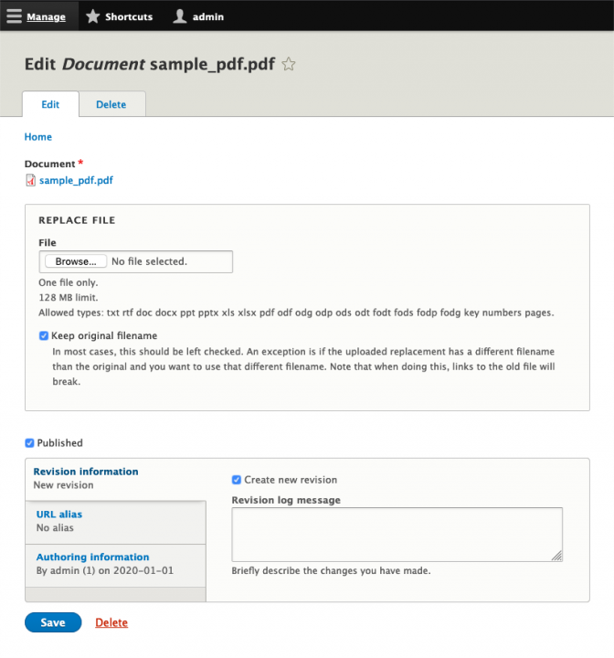

+++
author = "Brian Osborne"
title = "Introducing the Media Entity File Replace module"
date = 2020-01-01
tags = [
  "Drupal Planet",
]
+++

## The Problem
Replacing files uploaded to your Drupal site can be very frustrating. In most cases, when an editor wants to replace a document, they want to keep the exact same filename and filepath and just overwrite the contents of the file. This is important in cases where the file is linked to elsewhere throughout the website or on other websites outside of the editors control. If you use the media module to manage documents on your site, you'll quickly discover that it's not possible to upload a replacement file for a document and keep the same filename.

Why is this? The core file field allows you to remove and upload a replacement file. But when you upload a replacement file with the same filename, Drupal appends a number to the end of it, like \_0, \_1, etc. This is because the old file is not actually removed from the filesystem immediately. Drupal will mark it as a temporary file and it will be removed during a cron run sometime in the future (* see exception to this below). Drupal won't overwrite that file with the new one, so it appends a number to the end to make it unique. Drupal also does this to support revisions properly. If the file field is attached to an entity that has revisions enabled, then Drupal keeps that old file around because previous revisions may require it.

\* Actually, as of Drupal 8.4, [old unused files are never deleted](https://www.drupal.org/node/2891902) unless you have a specific config override set that enables this cleanup.

## Existing Contrib Solutions

There is a [4 year old Drupal core issue](https://www.drupal.org/project/drupal/issues/2648816) where the community has tried to resolve this problem. Probably the most popular solution has been to use the [Media Entity Download](https://www.drupal.org/project/media_entity_download) module. It works by creating a special route for each media entity that will directly return the file associated with that entity as a download. So if you had a document media entity with ID 59, editors can create links to /media/59/download and Drupal will serve the file directly from that path. This solves the problem because it hides the actual file system path from visitors. It doesn't matter what that path is or how many numbers Drupal has appended to the end of replacement files, the visitor never sees it and you'll never have broken links.

The main problem I have with Media Entity Download is that it gets Drupal involved in serving up the files which are normally not handled by Drupal at all. After all, the files are just sitting there in the public filesystem. The web server (apache, nginx) typically serves them to visitors and leaves Drupal out of it. With this module, every time a file is requested, Drupal is bootstrapped and a PHP process is tied up until the download completes to the visitor. This is a bit scary if you get a large surge of traffic with many users requesting large downloads.

## The New Solution

I just completed work on the [Media Entity File Replace](https://drupal.org/project/media_entity_file_replace) module to provide another solution to this problem. This module is intended for site builders that are using the Media module to manage documents on their site. It works by adding a replacement file widget to the media edit form for media types that use a file source (Image, Document, etc). You can control which specific media types it's enabled for by visiting the form display configuration and showing/hiding it. When replacement files are selected and the form is saved, the file is first uploaded to temporary storage and then copied over the existing file. The filepath and filename are kept in tact. Just the contents of the file and the metadata describing the file are updated - which is what editors want most of the time.

Note that the module still supports the previous behavior of NOT overwriting the original file. Editors just need to uncheck the "Keep original filename" checkbox and the replacement file will be uploaded and the media entity updated to reference it.

This module should fill a functionality gap in document management in Drupal - I hope others find it useful!
